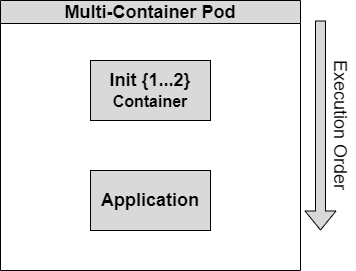

# Kubernetes Init Containers

# What are Init containers?

Init containers are special containers that run before main application container start in a pod. It will be run as a preparation for the main container like initialization, configuration or setup dependencies.

# Why use Init containers?

There are few advantages of using init containers

1. **Sequential Execution:** They can run a specified order, ensuring dependencies are met before running the main container.
2. **Separation of Concerns:** We can handle the setup tasks separately from the main application code.
3. **Enhanced Security:** They can run any utilities or custom codes out side of the main application code that will reduce any attacks.
4. **Resource Efficiency:** init containers will utilize same pod resources but, run to the completion before the main container starts.

# Examples:

Init containers will be useful in various scenarios.

1. **Database Initialization:** Waiting for database initialization before the main container start.
2. **Configuration Management:** Fetching configuration files or secrets from external sources.
3. **Data Preprocessing**: Validate or transform the data before main application consume the data.
4. **Network Setup:** Establish the network configurations to external services.
5. **Cache Warm-up:** Preload the frequently accessed data to cache systems like Redis.



# Practical Example: Web Server with Dynamic IP Display

We can create a simple Nginx server that will display its pod id address on the index page using init containers.

## Pre-requisites

You can use your own Kubernetes cluster of use free sandbox like [Redhat Open shift Developer Sandbox](https://developers.redhat.com/developer-sandbox)

1. Create a file named “pod-with-init-containers.yaml” with the following content or you can clone the below git hub repository.

```yaml
apiVersion: apps/v1
kind: Deployment
metadata:
  name: web-server-deployment
spec:
  replicas: 1
  selector:
    matchLabels:
      app: web-server
  template:
    metadata:
      labels:
        app: web-server
    spec:
      volumes:
      - name: web-content
        emptyDir: {}
      initContainers:
      - name: get-ip
        image: busybox
        command: ['sh', '-c', 'echo $POD_IP > /web-content/ip.txt']
        env:
        - name: POD_IP
          valueFrom:
            fieldRef:
              fieldPath: status.podIP
        volumeMounts:
        - name: web-content
          mountPath: /web-content
      - name: create-index
        image: busybox
        command: ['sh', '-c', 'echo "<h1>Pod IP: $(cat /web-content/ip.txt)</h1>" > /web-content/index.html']
        volumeMounts:
        - name: web-content
          mountPath: /web-content
      containers:
      - name: nginx
        image: nginxinc/nginx-unprivileged:stable-alpine #I am using the unprivileged image due to a limitation in Openshift cluster, You can use any nginx image.
        ports:
        - containerPort: 8080
        volumeMounts:
        - name: web-content
          mountPath: /usr/share/nginx/html
```

There are two init containers defined here, 

one init container “get-ip” will get the node IP Address using field reference values, save it to environment variable and then save that content to a file in volume mount.

The other init container “create-index” will get that value from the file and save it to index.html file in the same volume mount.

Finally, our application container “nginx” will read the index file. 

2. Apply the configuration

```yaml
kubectl apply -f pod-with-init-containers.yaml
```

3. Deploy a service to expose the port of the application container.

```yaml
apiVersion: v1
kind: Service
metadata:
  name: web-server-service
spec:
  type: NodePort # You can change this to ClusterIP or LoadBalancer as needed
  selector:
    app: web-server # This should match the pod label
  ports:
  - port: 8080 # Port that the service will expose
    targetPort: 8080 # Port on the container to forward requests to
```

4. Wait for the pod to be ready:

```yaml
kubectl get pods -w
```

5. Got to your load balancer or cluster dns to check whether the application is working.
    
    Example: [http://localhost:8080](http://localhost:8080/)
    
    