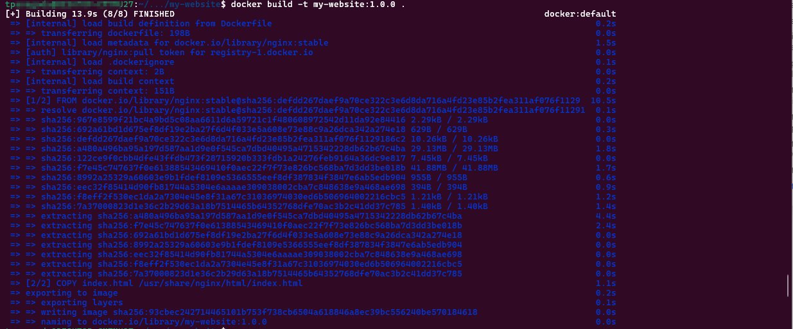

# How to Build Container Images: A Step-by-Step Guide for Beginners

Software development in today's world ensuring consistency and efficiency across environments is a crucial thing. So when we streamline the application deployments understanding of how to build container images is essential for developers as well as DevOps engineers. In this article, I have included in detailed explanation and walk you through the process of building containers and some of the important facts to keep in mind when working with containers.

> All the files related to the exercise will be available in the GitHub Repository, You can download or clone the files when you are trying this in your environment.
> 

# Table of Contents

1. What is a Container Image?
2. The Role of Docker and Dockerfile
3. Docker Installation
4. Creating your First Docker Image
5. Saving and Distributing Images

# What is a Container Image?

A container image is a package that includes everything necessary to run a piece of software. This will include the code, runtime, libraries, environment variables, and configurations. This will give you a consistent environment that can run your applications on various platforms which will ensure your code will run smoothly wherever it is deployed.

# The Role of Docker and Dockerfile

Docker is a powerful tool that developers can create, manage, and deploy their containerized applications. A Dockerfile is a script that contains the commands and instructions that Docker uses to build an image. Dockerfile enables consistent deployments and repeatable builds by defining what should be included in your container image.

# Docker Installation

In this tutorial we will be exploring how to build Docker images with live examples, to complete them you need to get installed Docker in your environment or you need to use an environment that already has Docker installed.

You can follow the official Docker installation guide to set up Docker in your environment based on your operating system.

[Docker Installation Guide](https://docs.docker.com/engine/install/)

# Creating your First Container Image

Creating a Docker image starts with a Dockerfile and running basic Docker commands. In the step-by-step guide below, I have included information about creating your first Docker image.

 

In this tutorial I will be using an Ubuntu environment, all of the commands will be aligned with that and most of the time across all the Linux platforms commands will be the same.

## Step-by-step guide to Building a Custom Image

### Step 01: Prepare your directory

Start making a new directory where we are going to put the Dockerfile and application files. Then go inside that folder to start working on the files

```bash
mkdir my-website
cd my-website
```

### Step 02: Create a simple application file

Here we will create a simple `index.html` file that we use in our webserver to display the `Hello, World!` in the body. 

```bash
vi index.html
```

Press `i` to enter Insert mode, Then copy the below content to `index.html` file

```html
<!DOCTYPE html>
<html>
<head>
    <title>Welcome</title>
</head>
<body>
    <h1>Hello, World!</h1>
</body>
</html>
```

Save and exit the vi editor, by pressing `Esc` and`:wq` and `Enter`

### Step 03: Create your Dockerfile

We will create the Dockerfile now, in this file we will indicate the base image and the other commands to set up the application.

```bash
vi Dockerfile
```

Copy the below content into the `Dockerfile` and save.

```docker
# Use the official NGINX base image
FROM nginx:stable

# Copy the index.html file to the appropriate directory
COPY index.html /usr/share/nginx/html/index.html
```

- `FROM nginx:stable`: Specify the Base Image, in here we will use nginx as we are going to create a web server image that will display our simple webpage. I have used the `stable` tag of the nginx base image to use a stable version.
- `COPY index.html`: This command will copy your `index.html` file to the NGINX web server’s default document root.

### Step 04: Build the Image

You can use `docker build` command to build the image now.

```bash
docker build -t my-website:1.0.0 .
```

`-t`: Use to tag the image with a name and a version, in here we use the name `my-website` and version as `1.0.0`

`.`: This will indicate to use of the current directly as the build context where we have our `Dockerfile` located.



You can verify whether the image is built correctly by running the below command. This will list down all of your local images with the newly built one. 

```bash
docker images
```


### Step 05: Run a container

Now you can run a container with your created docker image.

```bash
docker run --rm --name my-website -d -p 8080:80 my-website:1.0.0
```

- `--rm`: This property will remove the container once it stops.
- `--name`: We can use a name to identify the container easily, in here we use the name `my-website`
- `-d`: Run the container in detached mode, otherwise we will not be able to run any command in the current session after running the container.
- `-p`: This parameter is used to map a port in the host to the container, in here we mapped host port `8080` to container port `80`
- You can define the container image we created earlier at the end of the command as we did in here `my-website:1.0.0`


Check whether the container is running correctly by running the below command.

```bash
docker ps
```


Also, you can verify by visiting [`http://localhost:8080`](http://localhost:8080) whether it will show the webpage correctly.

```bash
 curl http://localhost:8080
```


You can see the logs to see what happening inside the container by running the below command.

```bash
docker logs my-website
```

You can specify either `container id` or `container name` to get the logs of a specific container. This will show the `Standard Output (stdout)` and `Standard Error (stderr)` of the container.


Now you can stop the container and it will remove the container as well.

```bash
docker stop my-website
```


# Saving and Distributing Images

## Saving Image as a File and Load the Saved file

When you have created an image there can be scenarios in which you might need it to be saved in a file and shared. 

```bash
docker save -o my-website_1.0.0.tar my-website:1.0.0
```

`-o`: You can give a file to save the image and the relevant image with the tagged version of it. Then file will be saved in the given location. In this case, I have saved it in the current directory as below.


You might need to remove the previously created image to verify whether we can load the image from the file, Execute the below command to remove the image first,

```bash
docker rmi my-website:1.0.0
```

Then you can run the below command to load the image from the saved file.

```bash
docker load -i my-website_1.0.0.tar 
```

`-i`: Here you can give the Docker image file you saved earlier.


## Push Image to a Container Registry

You can push the image to a container registry as well, here we will be pushing this to the Docker Hub container registry as a public image, to do this you need to have a Docker Hub account. Or else you can use your container registry if you have one.

First, you have to log in to the container registry. You can follow the official documentation on [How to log in to the Registry.](https://docs.docker.com/reference/cli/docker/login/)

Then you can tag the container image and push the image to the registry as below.

```bash
docker tag my-website:1.0.0 your_user_name/my-website:1.0.0
docker push your_user_name/my-website:1.0.0
```

Then you will see your image as below.


Thank you for reading this guide! I hope you've gained valuable insights into building and managing Docker images. If there’s anything I missed or if you have additional thoughts or ideas, please feel free to share them—I’d love to hear your feedback and continue the learning journey together. Happy containerizing!